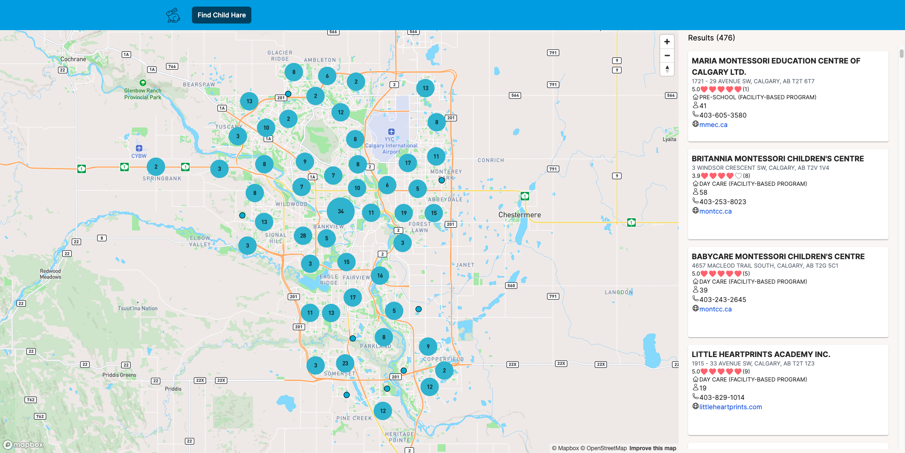

# Child Hare

The Child Hare web app helps parents find child care options for their kids in Alberta, Canada. I take personal pride in the app's performance, as it efficiently displays hundreds of child care locations without significant lag. The map viewport filters out any locations that fall outside of the current map view.

## Screenshots
### Main Page

(<a href="#readme-top">back to top)</a>

## Technologies Used

- JavaScript
- CSS
- PostgreSQL
- Sequelize
- Express
- Cors
- Morgan
- Dotenv
- Node.js
- REACT
- NEXT.js
- Typescript
- TailwindCSS
- daisyUI
- Material components by Google
- Heroicons
- Mapbox API and maps
- Google Place API
- react-virtualized & react-window

(<a href="#readme-top">back to top</a>)

## Getting Started

[Click to see the app!](https://child-hare.netlify.app/)

[Check out Trello sprint board](https://trello.com/b/qnsoGBgC/child-care)

[Click to see more in the planning.md](/lib/planning.md)

(<a href="#readme-top">back to top</a>)

<!-- ACKNOWLEDGMENTS -->
## Acknowledgments

* [Google Place Details API documentation](https://developers.google.com/maps/documentation/places/web-service/details#PlaceDetailsRequests)
* [Google Place Autocomplete API documentation](https://developers.google.com/maps/documentation/places/web-service/autocomplete)
* [Mapbox React Examples](https://github.com/mapbox/mapbox-react-examples) for building React apps with Mapbox GL JS
* [react-window documentation](https://react-window.vercel.app/#/examples/list/fixed-size)

(<a href="#readme-top">back to top</a>)

<!-- LICENSE -->
## License

Distributed under the MIT License. See `LICENSE` for more information.

(<a href="#readme-top">back to top</a>)

## Ice Box

- CC-6 AAU, I want to filter cards and pins of child care facilities displayed by type, city, capacity and Google rating
- CC-7 AAU, I want to view card details (name, type, address, city, province, postal code, phone number, capacity) when clicking on individual card
- CC-8 AAU, I want to view additionally website and Google rating on card details
- CC-9 AAU, I want to view child care reviews on card details
- CC-10 AAU, I want to view child care photos on card details
- CC-11 AAU, I want to see what card(s) is/are associated with pin (cluster) when clicking on pin (cluster)
- CC-12 AAU, I want to see what pin (cluster) is associated with a card when hovering on the card
- Require users to log in to create a favorites list of child care places
- Enlarge the map pin for easier clicking or tapping.
- On mobile devices, separate the map and card list views. Remove the need to open them together
- Implement a drawer or radius filter on the map
- Enable users to call a child care facility by clicking the 'Call' button on the details page
- Review and adjust the colors and radius for clusters
- Allow users to expand a card by swiping upward
- Implement a sorting feature

(<a href="#readme-top">back to top</a>)
