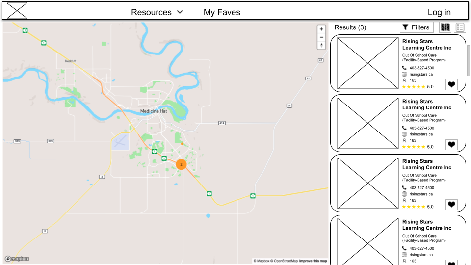
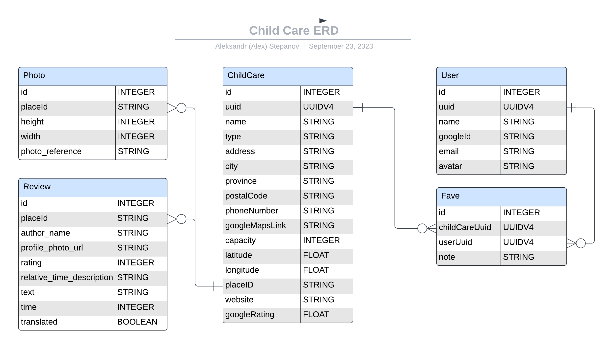

# Child Care Finder - Project 4 Planning

Done by Aleksandr (Alex) Stepanov

## Project Choice - Route Finder

"Child Care Finder" app is designed to help parents to find child care for their kids in Alberta, Canada.

## Wireframes

### Main page



## Entity Relationship Diagram



[ERD on Lucid.app](https://lucid.app/lucidchart/44c240e0-ca0b-42a3-895e-cae26f10487d/edit?viewport_loc=-1523%2C-462%2C2108%2C1045%2C0_0&invitationId=inv_62f2c577-c317-4d92-9485-e4fc78e2f8b2)

## MVP CRUD / RESTful Routes

| Route name | CRUD operation               | URL endpoint      | Module name    | Controller Action |
| ---------- | ---------------------------- | ----------------- | -------------- | ----------------- |
| POST       | Create a childcare           | /childcares       | childCaresCtrl | create            |
| GET        | Read all childcares          | /childcares       | childCaresCtrl | index             |
| GET        | Read a specific childcare    | /childcares/:uuid | childCaresCtrl | show              |
| PUT        | Update a specific childcare  | /childcares/:uuid | childCaresCtrl | update            |
| DELETE     | Delete a specified childcare | /childcares/:uuid | childCaresCtrl | delete            |

## JSON Samples - Google Geocoding API

[Google Autocomplete documentation](https://developers.google.com/maps/documentation/places/web-service/autocomplete)

### Get Autocomplete Response

**GET** https://maps.googleapis.com/maps/api/place/autocomplete/json?input={name}%20{address}%20{city}%20{province}%20{postalCode}&components=country:ca&types=establishment&key={YOUR_API_KEY}

**Content-Type:** application/json

```json
{
  "predictions": [
    {
      "description": "VonKids Dayhomes, Bel-Aire Place Southwest, Calgary, AB, Canada",
      "matched_substrings": [],
      "place_id": "ChIJNRrrdR5pcVMRB9LFBjz_g6c",
      "reference": "ChIJNRrrdR5pcVMRB9LFBjz_g6c",
      "structured_formatting": {
        "main_text": "VonKids Dayhomes",
        "secondary_text": "Bel-Aire Place Southwest, Calgary, AB, Canada"
      },
      "terms": [
        {
          "offset": 0,
          "value": "VonKids Dayhomes"
        },
        {
          "offset": 18,
          "value": "Bel-Aire Place Southwest"
        },
        {
          "offset": 44,
          "value": "Calgary"
        },
        {
          "offset": 53,
          "value": "AB"
        },
        {
          "offset": 57,
          "value": "Canada"
        }
      ],
      "types": ["school", "point_of_interest", "establishment"]
    }
  ],
  "status": "OK"
}
```

### Get Place Details Response

**GET** https://maps.googleapis.com/maps/api/place/details/json?fields=name%2Crating%2Cformatted_phone_number&place_id={placeId}&key={YOUR_API_KEY}

**Content-Type:** application/json

```json
{
  "html_attributions": [],
  "result": {
    "address_components": [
      {
        "long_name": "35",
        "short_name": "35",
        "types": ["street_number"]
      },
      {
        "long_name": "Bel-Aire Place Southwest",
        "short_name": "Bel-Aire Pl SW",
        "types": ["route"]
      },
      {
        "long_name": "Bel-Aire",
        "short_name": "Bel-aire",
        "types": ["neighborhood", "political"]
      },
      {
        "long_name": "Calgary",
        "short_name": "Calgary",
        "types": ["locality", "political"]
      },
      {
        "long_name": "Alberta",
        "short_name": "AB",
        "types": ["administrative_area_level_1", "political"]
      },
      {
        "long_name": "Canada",
        "short_name": "CA",
        "types": ["country", "political"]
      },
      {
        "long_name": "T2V 2C3",
        "short_name": "T2V 2C3",
        "types": ["postal_code"]
      }
    ],
    "adr_address": "<span class=\"street-address\">35 Bel-Aire Pl SW</span>, <span class=\"locality\">Calgary</span>, <span class=\"region\">AB</span> <span class=\"postal-code\">T2V 2C3</span>, <span class=\"country-name\">Canada</span>",
    "business_status": "OPERATIONAL",
    "current_opening_hours": {
      "open_now": false,
      "periods": [
        {
          "close": {
            "date": "2023-09-25",
            "day": 1,
            "time": "1730"
          },
          "open": {
            "date": "2023-09-25",
            "day": 1,
            "time": "0730"
          }
        },
        {
          "close": {
            "date": "2023-09-26",
            "day": 2,
            "time": "1730"
          },
          "open": {
            "date": "2023-09-26",
            "day": 2,
            "time": "0730"
          }
        },
        {
          "close": {
            "date": "2023-09-27",
            "day": 3,
            "time": "1730"
          },
          "open": {
            "date": "2023-09-27",
            "day": 3,
            "time": "0730"
          }
        },
        {
          "close": {
            "date": "2023-09-28",
            "day": 4,
            "time": "1730"
          },
          "open": {
            "date": "2023-09-28",
            "day": 4,
            "time": "0730"
          }
        },
        {
          "close": {
            "date": "2023-09-29",
            "day": 5,
            "time": "1730"
          },
          "open": {
            "date": "2023-09-29",
            "day": 5,
            "time": "0730"
          }
        }
      ],
      "weekday_text": [
        "Monday: 7:30 AM – 5:30 PM",
        "Tuesday: 7:30 AM – 5:30 PM",
        "Wednesday: 7:30 AM – 5:30 PM",
        "Thursday: 7:30 AM – 5:30 PM",
        "Friday: 7:30 AM – 5:30 PM",
        "Saturday: Closed",
        "Sunday: Closed"
      ]
    },
    "formatted_address": "35 Bel-Aire Pl SW, Calgary, AB T2V 2C3, Canada",
    "formatted_phone_number": "(587) 700-9110",
    "geometry": {
      "location": {
        "lat": 50.9997455,
        "lng": -114.0919796
      },
      "viewport": {
        "northeast": {
          "lat": 51.0009523802915,
          "lng": -114.0904678697085
        },
        "southwest": {
          "lat": 50.9982544197085,
          "lng": -114.0931658302915
        }
      }
    },
    "icon": "https://maps.gstatic.com/mapfiles/place_api/icons/v1/png_71/school-71.png",
    "icon_background_color": "#7B9EB0",
    "icon_mask_base_uri": "https://maps.gstatic.com/mapfiles/place_api/icons/v2/school_pinlet",
    "international_phone_number": "+1 587-700-9110",
    "name": "VonKids Dayhomes",
    "opening_hours": {
      "open_now": false,
      "periods": [
        {
          "close": {
            "day": 1,
            "time": "1730"
          },
          "open": {
            "day": 1,
            "time": "0730"
          }
        },
        {
          "close": {
            "day": 2,
            "time": "1730"
          },
          "open": {
            "day": 2,
            "time": "0730"
          }
        },
        {
          "close": {
            "day": 3,
            "time": "1730"
          },
          "open": {
            "day": 3,
            "time": "0730"
          }
        },
        {
          "close": {
            "day": 4,
            "time": "1730"
          },
          "open": {
            "day": 4,
            "time": "0730"
          }
        },
        {
          "close": {
            "day": 5,
            "time": "1730"
          },
          "open": {
            "day": 5,
            "time": "0730"
          }
        }
      ],
      "weekday_text": [
        "Monday: 7:30 AM – 5:30 PM",
        "Tuesday: 7:30 AM – 5:30 PM",
        "Wednesday: 7:30 AM – 5:30 PM",
        "Thursday: 7:30 AM – 5:30 PM",
        "Friday: 7:30 AM – 5:30 PM",
        "Saturday: Closed",
        "Sunday: Closed"
      ]
    },
    "photos": [
      {
        "height": 1810,
        "html_attributions": [
          "<a href=\"https://maps.google.com/maps/contrib/106148242299351965784\">VonKids Dayhomes</a>"
        ],
        "photo_reference": "ATJ83ziOyFPv5xtdD2Lon36z1WSGk70BkmX3aQzWPHgc2m4SfG7Y2g4oqnR_yIZVzmABwRrft7YcPyC4isMNAWn0RlGzuV-ZJ-265RyLeA4DEVDP-tizEIVz-D_toXWY5db3I3ifCI6aTvzVDjzxZCJ6zzrLsFaDThkDxUS6OD-S0b0UKV65",
        "width": 2716
      },
      {
        "height": 448,
        "html_attributions": [
          "<a href=\"https://maps.google.com/maps/contrib/106148242299351965784\">VonKids Dayhomes</a>"
        ],
        "photo_reference": "ATJ83zh56iN7Yg0ZsITDgN-2P8uPeRTGXK8IcxqgLpXmL1FeXX8rsI4dDRZJHiA-r6YdkcqBU9ntFtWwj9gkXm7rhnc50SAoeDIOTiEZUnQLRJ9YQszhhL3L27kmaojNrpSSEO83mnMSWwRcRd9AgwVIA1oUvSkBilzlk4rfzHicVKjpsfdn",
        "width": 1023
      },
      {
        "height": 600,
        "html_attributions": [
          "<a href=\"https://maps.google.com/maps/contrib/106148242299351965784\">VonKids Dayhomes</a>"
        ],
        "photo_reference": "ATJ83zgVLP5bJGeLXzA7qfro4xFgdK5Ln02rochpgoEBsLNdqemtc8H_nwAkQLo6mWSiTrOSfwB4ZVwXkT4kKZ5Rn0kKOW-ZH0PwdwoksrPBdHWlf_5XZL4nUbRsRLgmURksDv_E_D-LGYdPRggbKm3ycQmzc33IIMEIC6EbAlHNkbCUkyr-",
        "width": 900
      },
      {
        "height": 383,
        "html_attributions": [
          "<a href=\"https://maps.google.com/maps/contrib/106148242299351965784\">VonKids Dayhomes</a>"
        ],
        "photo_reference": "ATJ83zhZglqAzPaU0ruVYu62qemqjPIeuS5LVFSMfVuMdkHjnHKJUwvKLIXkCiyIa6VhA31itvCyr_TfSmHNG5Vrzo18UNkjp2lh1I-cJ0ZNh_n32y4618NNxG5sRuFYH0NRn0cOFJYDS7jNA9FJehowRBkORBEcZc8MbJHfXBMDcCCt1OGQ",
        "width": 576
      }
    ],
    "place_id": "ChIJNRrrdR5pcVMRB9LFBjz_g6c",
    "plus_code": {
      "compound_code": "XWX5+V6 Calgary, AB, Canada",
      "global_code": "9527XWX5+V6"
    },
    "rating": 3.6,
    "reference": "ChIJNRrrdR5pcVMRB9LFBjz_g6c",
    "reviews": [
      {
        "author_name": "Rachel Kimak",
        "author_url": "https://www.google.com/maps/contrib/116484821419885440393/reviews",
        "language": "en",
        "original_language": "en",
        "profile_photo_url": "https://lh3.googleusercontent.com/a/ACg8ocKF2oh4JC8dK2COEGGpjuXHp4fWdoDZ9AgpCDc93UYJ=s128-c0x00000000-cc-rp-mo",
        "rating": 5,
        "relative_time_description": "6 months ago",
        "text": "We LOVE Von Kids! Our daughter just started in December at 12 months old and she loves her teacher Miss Elsa so much she asks for her every time we get into the car! We feel that our daughter is so loved and cared for at Von Kids and we plan to send our second child here as well. Thank you!!",
        "time": 1677523526,
        "translated": false
      },
      {
        "author_name": "Elena Landes",
        "author_url": "https://www.google.com/maps/contrib/102339747269532649075/reviews",
        "language": "en",
        "original_language": "en",
        "profile_photo_url": "https://lh3.googleusercontent.com/a/ACg8ocJGveVjh5YLeh5X76Ry_kEWi0XsO4-NDHylpzQVmF1g=s128-c0x00000000-cc-rp-mo",
        "rating": 5,
        "relative_time_description": "6 months ago",
        "text": "Our two kids went to a Vonkids dayhome for 3 and 1/2 years and we would recommend them in a heartbeat. We were always impressed with the quality of the staff and the program in general. The dayhome Directors are caring, patient, kind, and take the time to  respect each child's individuality. They provide a variety of learning activities (it was amazing to see our little ones learn to count in English and Spanish at the same time!). With physical play and activities like yoga and dancing, at the end of the day my kids were always happy from a day filled with learning and play!\nMiss Jaziel at Bluebird specifically, has always been so attentive and an amazing teacher, and Mrs Tessy the program coordinator has been extremely helpful and kind to our family, as we tried to find the right fit.",
        "time": 1678482410,
        "translated": false
      },
      {
        "author_name": "Kari Mandin",
        "author_url": "https://www.google.com/maps/contrib/113852303747891430637/reviews",
        "language": "en",
        "original_language": "en",
        "profile_photo_url": "https://lh3.googleusercontent.com/a/ACg8ocJsEFoAOVkdWI1A7ctRo2wwSBhPWnGeekDC6sIe9MWD=s128-c0x00000000-cc-rp-mo",
        "rating": 5,
        "relative_time_description": "a year ago",
        "text": "My son has attended the Inspire day home in Tuscany since October of 2021. I can't even begin to express how happy we are with Maritza, his day home provider. She is welcoming, warm and friendly and as I've watched her interact with the kids during pick up and drop off and in the videos that she sends, it is clear how deeply she cares for each of the children.\nWe are so grateful for her and have been so impressed by her communication and the joy that she brings to her work. As a working mom, it can be very challenging to leave your child with someone else but I feel confident when I drop Carter off in the morning that he is well cared for, learning new things and having fun at his day home.",
        "time": 1661890982,
        "translated": false
      },
      {
        "author_name": "Meagan Gross",
        "author_url": "https://www.google.com/maps/contrib/110289907138216764721/reviews",
        "language": "en",
        "original_language": "en",
        "profile_photo_url": "https://lh3.googleusercontent.com/a/ACg8ocKZ4U46eZo8Curuyn0PMiQoMTL33WQ_SDxdiYzH8HNZ=s128-c0x00000000-cc-rp-mo",
        "rating": 5,
        "relative_time_description": "a year ago",
        "text": "I am beyond happy with the care my son receives at his VonKids Dayhome. I feel so comfortable being back at work knowing he is so well cared for, and having so much fun. Miss Sonia goes above and beyond to implement routines, song, dance, playtime, sensory, and learning, all with a small group in a dayhome environment. She also provides many pictures and videos through out the day as well as a detailed report at the end of the day.  I would highly recommend VonKids.",
        "time": 1659649606,
        "translated": false
      },
      {
        "author_name": "Samantha Elekes",
        "author_url": "https://www.google.com/maps/contrib/106123792552778482598/reviews",
        "language": "en",
        "original_language": "en",
        "profile_photo_url": "https://lh3.googleusercontent.com/a/ACg8ocIQPy148KiUovgoAk4UntzavOB8V5KSYTAIR6YbfX4c=s128-c0x00000000-cc-rp-mo",
        "rating": 5,
        "relative_time_description": "11 months ago",
        "text": "I would highly recommend Von Kids. My son has been with Von Kids since he turned 1 and he absolutely loves it. Edwinna at the Caterpillar dayhome and Elsa at Ladybug are outstanding caregivers. My son adores them both and we are so grateful for his time with Von Kids. Edwinna cares deeply about all of the kids and it is amazing to see how connected she is with all the children.",
        "time": 1666624619,
        "translated": false
      }
    ],
    "types": ["school", "point_of_interest", "establishment"],
    "url": "https://maps.google.com/?cid=12070772059559809543",
    "user_ratings_total": 12,
    "utc_offset": -360,
    "vicinity": "35 Bel-Aire Place Southwest, Calgary",
    "website": "http://www.vonkids.com/"
  },
  "status": "OK"
}
```

## Component Tree

## Trello Sprint Board

Trello sprint board [link](https://trello.com/b/qnsoGBgC/child-care)

## User Stories

| US_ID\_\_# | Short Name | Description | SP  | Priority | Risk | Sprint | Dependant on US ID# |
| ---------- | ---------- | ----------- | --- | -------- | ---- | ------ | ------------------- |
| ✅CC-1  | View map with clusters | AAU, I want to view a map with clusters or individual pins that represent child care facilities. | 5 | 1 | High | 1 |  |
| ✅CC-2  | Navigation bar | AAU, I want to access links to "Find Child Care", "Resources" and "About" pages via a navigation bar at the top of the page | 2 | 2 | Low | 1 |  |
| ✅CC-3  | View Child Care basic cards | AAU, I want to view cards of child care facilities with their names, types, phone numbers, capacities | 3 | 1 | Medium | 1 | |
| ✅CC-4  | View results number found | AAU, I want to view the number of results found above the cards | 1 | 1 | Low | 1 | CC-3 |
| ✅CC-5  | View Child Care advanced cards | AAU, I want to view cards of child care facilities with their website link, Google rating | 2 | 1 | High | 1 | CC-3 |
| CC-6    | Filter Child Care facilities | AAU, I want to filter cards and pins of child care facilities displayed by type, city, capacity and Google rating | 3 | 2 | Medium |  | CC-5 |
| CC-7    | View card basic details | AAU, I want to view card details (name, type, address, city, province, postal code, phone number, capacity) when clicking on individual card | 5 | 1 | Medium | 3 | CC-3 |
| CC-8    | View card advanced details | AAU, I want to view website and Google rating on card details | 1 | 1 | Medium | 3 | CC-7 |
| CC-9    | View reviews details | AAU, I want to view child care reviews on card details | 2 | 1 | Medium | 3 | CC-7 |
| CC-10   | View photos details | AAU, I want to view child care photos on card details | 3 | 1 | High |  | CC-7 |
| ✅CC-11 | Highlight card(s) when clicking on pin | AAU, I want to see what card(s) is/are associated with pin  when clicking on pin | 3 | 1 | High | 2 | CC-3 |
| ✅CC-12 | Highlight pin when hovering on card | AAU, I want to see what pin is associated with a card when hovering on the card | 2 | 1 | High | 2 | CC-3 |
| ✅CC-13 | View cards only visible on map | AAU, I want to view only those cards of child care facilities that are currently visible on the map | 2 | 1 | Medium | 1 | CC-3 |
| CC-14   | Search child care | AAU, I want to search child care facilities' names and display only those cards and pins that correspond to this search | 3 | 2 | Medium |  | CC-3 |
| ✅CC-15 | Sort cards by distance | AAU, I want to sort child care facilities by distance from the map centre | 3 | 2 | Medium | 1 | CC-3 |
| CC-16   | View name and rating at unclustered pin | AAU, I want to view a name and a rating score for each unclustered pin on the map | 3 | 1 | Medium | 3 | CC-1 |
| CC-17   | Sort cards by name | AAU, I want to sort child care facilities by their names | 2 | 2 | Medium |  | CC-3 |
| CC-18   | Sign up using Google account or email | AAU, I want to be able to sign up using Google account or email | 5 | 2 | Medium |  |  |
| CC-19   | Log in using Google account or email | AAAH, I want to be able to log in using Google account or email | 1 | 2 | Medium |  | CC-18 |
| CC-20   | Add faves to My Faves | AAAH, I want to access My Faves menu option in navigation bar and be able to add a child care to My Faves only if I am logged in user | 5 | 2 | Low |  | CC-19 |
| CC-21   | Remove faves from My Faves | AAAH, I want to be able to remove a child care from My Faves  | 2 | 2 | Low |  | CC-20 |