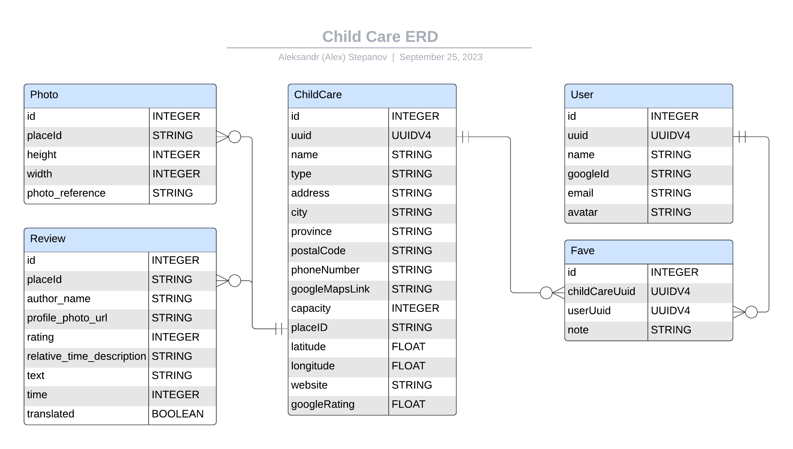

# Child Care Finder - Project 4 Planning

Done by Aleksandr (Alex) Stepanov

## Project Choice - Route Finder

"Child Care Finder" app is designed to help parents to find child care for their kids in Alberta, Canada.

## Wireframes

### Main page


## Entity Relationship Diagram



[ERD on Lucid.app](https://lucid.app/lucidchart/44c240e0-ca0b-42a3-895e-cae26f10487d/edit?viewport_loc=-1523%2C-462%2C2108%2C1045%2C0_0&invitationId=inv_62f2c577-c317-4d92-9485-e4fc78e2f8b2)

## MVP CRUD / RESTful Routes
 Route name | CRUD operation | URL endpoint | Module name | Controller Action | Notes |
|----------|----------|----------|----------|----------|----------|

## JSON Samples - Google Geocoding API

[Google Geocoding API documentation](https://docs.mapbox.com/api/navigation/optimization/)

### Submit Geocoding Request

__POST__ /optimized-trips/v2?access_token=pk.eyJ1Ijoic3RlcGFub3Zjb2RlcyIsImEiOiJjbGxzdjVuc2kwMTBuM2VxdGpzcHRtMnl4In0.r0XemjswrRcT_waet1Ra-A

__Host:__ api.mapbox.com

__Content-Type:__ application/json

```json
{
  
}
```

### Get Geocoding Response

__GET__ /optimized-trips/v2/123e4567-e89b-12d3-a456-426655440000?access_token=pk.eyJ1Ijoic3RlcGFub3Zjb2RlcyIsImEiOiJjbGxzdjVuc2kwMTBuM2VxdGpzcHRtMnl4In0.r0XemjswrRcT_waet1Ra-A

__Host:__ api.mapbox.com

__Content-Type:__ application/json

```json
{
   
}
```

## Component Tree

## Trello Sprint Board

Trello sprint board [link](https://trello.com/invite/b/PcfGsH7j/ATTI7b7c87f894baa428babcfacad30713a0625CD735/route-finder)

## User Stories

| US_ID__# | Short Name | Description | SP | Priority | Risk | Sprint | Dependant on US ID# |
|-------|------------|-------------|----|----------|------|--------|---------------------|